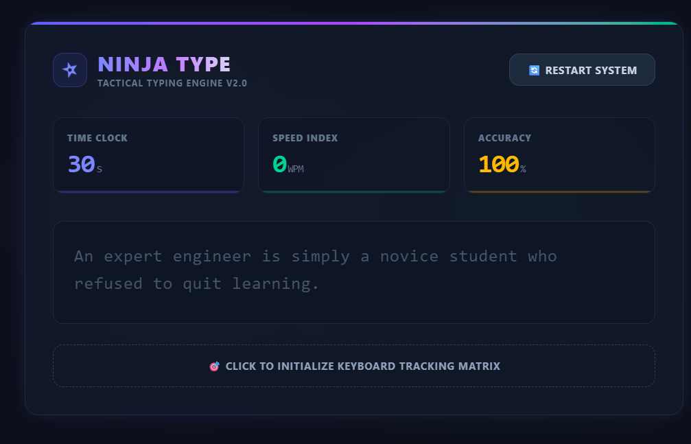
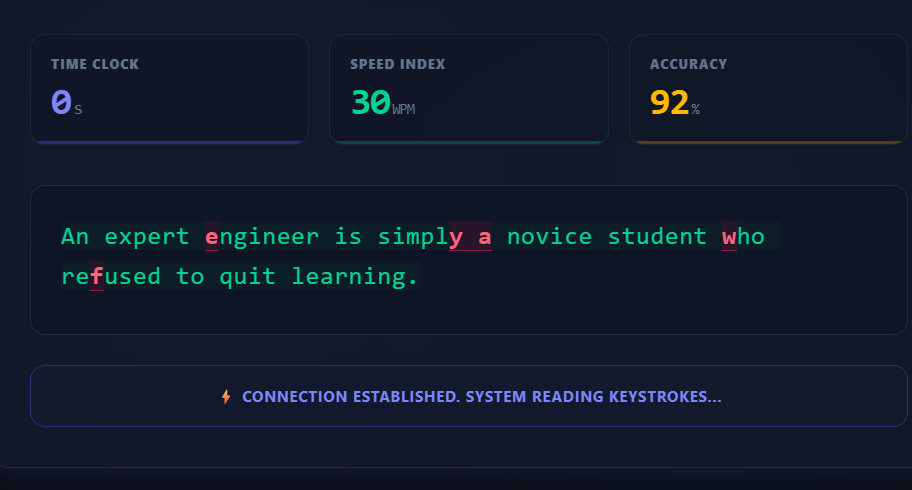

# Ninja Type - Speed Challenge

This is a client-side web application developed for a B.Tech 1st year programming project. The project is a typing speed tester built using HTML, vanilla JavaScript for logic, and Tailwind CSS for the user interface. It calculates typing metrics like Words Per Minute (WPM) and accuracy dynamically in the browser without needing a backend database or server.

---

## Technical Project Logic and Flow

The application runs entirely inside the user's web browser. It uses JavaScript event listeners to track user input in real time.

### How the Project Works:
1. **Input Tracking:** An invisible HTML text box holds the focus on the page. When the user types on their keyboard, JavaScript captures the keys.
2. **Checking Letters:** The code compares the user's input string index with the target sentence array index. If the letter matches, the JavaScript changes the text color to green using Tailwind classes. If it is wrong, it marks it red with an underline.
3. **WPM Calculation:** A standard JavaScript timer interval runs every second. The system calculates the typing speed using this standard formula:
   $$\text{WPM} = \frac{(\text{Total Characters Typed} / 5)}{\text{Time Elapsed in Minutes}}$$
4. **Accuracy Calculation:** The accuracy percentage is computed by checking the number of wrong keys pressed against the total keys pressed:
   $$\text{Accuracy} = \left( \frac{\text{Total Keys} - \text{Incorrect Keys}}{\text{Total Keys}} \right) \times 100$$

---

## Technologies Used

* **Frontend Layout:** Tailwind CSS v4 (Used for creating the dark mode grid layout and metric boxes)
* **Application Logic:** Vanilla JavaScript / ES6 (Used for the timer interval, score calculations, and matching text characters)
* **Hosting Platform:** GitHub Pages (Used to host the static HTML website files for free)

---

## Project Screenshots

Here is a look at the project interface and features:

### 1. Main Dashboard Screen Before Typing

### 2. Active Test Screen with Real-Time Scores

---

## Live Application Link
The project is hosted live and can be accessed at this URL:
Link: https://sumitsoni06.github.io/Ninja-type/